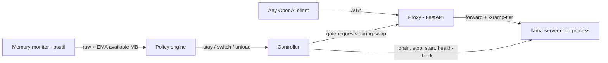

# RAMP — Resource-Aware Model Proxy

**Your local LLM should get out of the way when you need the RAM back.**

[](https://github.com/shivapreetham/resource-aware-model-proxy/actions/workflows/ci.yml)
[](LICENSE)
[](https://www.python.org/downloads/)

RAMP is an elastic daemon that sits in front of llama.cpp or Ollama. It
watches RAM, VRAM, and disk continuously, and moves the loaded model up and
down a *quality ladder* as your machine gets busy and quiets down:

- You open Chrome with 40 tabs → RAMP swaps your 7B model for a 3B one.
- You close them → after a stable recovery window, the 7B comes back.
- Your assistant never dies with an OOM, and you never reconfigure anything.

It speaks the OpenAI API, so **Open-LLM-VTuber, Khoj, SillyTavern, LangChain,
Continue, or `curl` just point `base_url` at RAMP and work unchanged** — no
code, no client plugin, nothing to adopt. Swaps cost ~2 seconds warm
(measured), and in-flight requests are drained rather than dropped.

```diff
- client = OpenAI(base_url="http://localhost:11434/v1")   # straight to Ollama
+ client = OpenAI(base_url="http://localhost:8090/v1")    # through RAMP
```

That's the entire integration. Verified against the official `openai` Python
SDK: model listing, streaming, and hard-coded model names all work untouched.
Ollama's native `/api/*` routes are proxied too, for tools that use those.

**Or change nothing at all.** `ramp run --transparent` puts RAMP *on* Ollama's
port and moves Ollama behind it, so every tool you already have routes
through RAMP without touching a single config:

```bash
ramp run --transparent
```

It asks before doing it, starts the relocated Ollama and proves it healthy
*before* stopping the original, rolls back on any failure, and puts Ollama
back on its own port when RAMP exits. If it can't do all that safely, it
refuses and changes nothing. Should RAMP ever be killed outright, `ramp
restore` puts Ollama back.

> **Just want to see it work?** [DEMO.md](DEMO.md) walks through a live
> demo in 5 minutes with no models to download.
>
> **Want to know how it works?** [docs/CONCEPTS.md](docs/CONCEPTS.md) explains what's actually
> going on: what consumes memory when an LLM runs, why VRAM pressure silently
> becomes RAM pressure, and the control-theory ideas (hysteresis, damping)
> behind the policy.

## Why this doesn't already exist

Everyone running a local model has made the same bad trade: pick a big model
and let the machine choke, or pick a small one and pay for the worst case all
day. The tools make you choose **once, up front, forever**.

- **Ollama / LM Studio** pick a quantization *once*, at download/load time.
  Nothing adapts after that ([ollama#14674](https://github.com/ollama/ollama/issues/14674)).
- **[llama-swap](https://github.com/mostlygeek/llama-swap)** swaps models based
  on *which model the client requests* — the system's resource state is never
  consulted.
- **FlexQuant / LSAQ / Voltron / Any-Precision LLM** validated elastic
  execution academically; none ship as a usable daemon.

RAMP is the missing controller: policy-driven, hysteresis-damped,
backend-agnostic, and measured — it reports its own swap rate so you can prove
it isn't thrashing.

## Architecture



| Module | Role |
|---|---|
| `monitor.py` | Samples available RAM, GPU/VRAM (NVIDIA, via `nvidia-smi`), and free disk — each with raw + smoothed readings. |
| `policy.py` | Pure state machine: fast downgrades under pressure, slow damped upgrades, critical-floor emergency handling. Fully unit-tested, no I/O. |
| `controller.py` | Executes decisions: drain in-flight requests → stop old backend → start new → reopen the gate. Restarts crashed backends. Records an event log. |
| `backend.py` | Child-process lifecycle for `llama-server` (real) or `ramp.mock_llm` (demo/tests). |
| `server.py` | OpenAI-compatible passthrough (incl. SSE streaming) + control API. |

### The decision policy

Every tier declares its footprint (`est_ram_mb`, and `est_vram_mb` when it
runs on the GPU), and the policy holds **RAM, VRAM, and disk** accountable:

- **Downgrade (fast):** free RAM below `safety_margin_mb` — or, for a
  GPU-resident tier, free VRAM below `vram_safety_margin_mb` — for
  `downgrade_after_samples` consecutive polls → switch to the largest smaller
  tier that fits *every* projected post-swap budget. A GPU-starved ladder can
  land on a CPU-only tier (`est_vram_mb: 0`).
- **Critical (instant):** free RAM below `critical_free_mb` → act immediately;
  if even the smallest tier can't fit, unload entirely (requests queue/503
  until memory returns).
- **Upgrade (slow):** a bigger tier must fit both RAM and VRAM budgets with
  *extra* headroom (`upgrade_extra_mb` / `vram_upgrade_extra_mb`), sustained
  for `upgrade_after_s` seconds, before it's loaded — so RAMP never thrashes
  when you alt-tab.
- **Disk (gate):** free disk below `disk_min_free_mb` blocks upgrades — a
  bigger model can't free disk, so it gates rather than downgrades — and is
  flagged in `/ramp/status` (`disk.low: true`).
- No NVIDIA GPU (or no `nvidia-smi`)? VRAM constraints are simply not
  enforced; everything else works unchanged.
- Swaps happen **between** requests: in-flight generations are drained first
  (up to `drain_timeout_s`), and incoming requests wait on the swap gate
  instead of failing.

## Install

RAMP is a Python CLI, so it installs like one. No config file needed — it
inspects your machine and your installed Ollama models and builds a ladder
itself.

```bash
uvx ramp-llm            # run without installing anything (needs uv)
pipx install ramp-llm   # or install it properly
pip install ramp-llm    # or into the current environment
```

<details>
<summary>Docker</summary>

```bash
docker build -t ramp .
docker run --rm -p 8090:8090 \
  --add-host=host.docker.internal:host-gateway \
  -e RAMP_OLLAMA_URL=http://host.docker.internal:11434 \
  ramp
```

Add `--gpus all` (with the NVIDIA container toolkit) for VRAM awareness. Note
that inside a container RAMP reads the *container's* memory limit — which is
usually what you want, but means `--memory` shapes its decisions.
</details>

Then:

```bash
ramp doctor    # check this machine can run it, and what to fix if not
ramp           # start, with an auto-detected ladder
ramp status    # what's loaded, why, and what it's costing
```

`ramp` prints the endpoint to point your tools at. That's the whole setup.

<details>
<summary>Other commands</summary>

```bash
ramp init                  # write the auto-detected ladder to ramp.yaml to tune
ramp run -c ramp.yaml      # start from an explicit config
ramp run --transparent     # serve on Ollama's port so existing tools just work
ramp restore               # undo transparent mode after an unclean shutdown
ramp status --json         # raw status for scripting
ramp --help
```

`ramp run` with no `-c` uses `./ramp.yaml` if present, otherwise auto-detects.
</details>

## Try it without any models

The `mock` backend runs the whole daemon against fake OpenAI servers that tag
their replies with the tier name — so you can watch the laddering behaviour
in about thirty seconds, with nothing to download.

The example configs live in this repo, so grab one first if you installed
from PyPI:

```bash
curl -O https://raw.githubusercontent.com/shivapreetham/resource-aware-model-proxy/main/examples/ramp.mock.yaml
curl -O https://raw.githubusercontent.com/shivapreetham/resource-aware-model-proxy/main/scripts/stress_ram.py
ramp run -c ramp.mock.yaml
```

Then, in another terminal:

```bash
curl http://127.0.0.1:8090/ramp/status
python stress_ram.py --mb 6000 --hold-s 60
```

Watch the reply tag flip from `[large-mock]` to a smaller tier while the
stress script runs, and back ~20s after it releases. Every response carries
an `x-ramp-tier` header naming the tier that produced it.

## Real models (Ollama backend)

If you already run [Ollama](https://ollama.com) (or your OS blocks unsigned
binaries — e.g. Windows Smart App Control), use `backend: ollama`
(see [examples/ramp.ollama.yaml](examples/ramp.ollama.yaml)). Tiers reference
Ollama model tags; RAMP loads/unloads them via `keep_alive`, rewrites each
request's `model` field to the active tier, and proxies to Ollama's OpenAI
API. Import your own GGUFs with `ollama create <tag> -f Modelfile`
(`FROM ./model.gguf`). If no Ollama server is running, RAMP spawns one.

## Real models (llama.cpp)

1. Install [llama.cpp](https://github.com/ggml-org/llama.cpp) so `llama-server`
   is on your PATH (or set `llama_server_bin` to its full path).
2. Download 2–3 GGUF models of different sizes (e.g. Qwen2.5 7B/3B/0.5B
   instruct, Q4_K_M).
3. Edit `examples/ramp.yaml` — paths, `ctx`, and `est_ram_mb` per tier.
   To calibrate `est_ram_mb`: pin the tier, look at the llama-server process
   in Task Manager, round up.
4. `ramp -c examples/ramp.yaml`, then point any OpenAI client at
   `http://127.0.0.1:8090/v1`.

## Control API

| Endpoint | Purpose |
|---|---|
| `GET /ramp/status` | Current tier, RAM/GPU/disk readings, `last_decision` (why RAMP is holding — e.g. `disk-low`, `upgrade-pending`), tier ladder, metrics, and event log. |
| `GET /ramp/metrics` | Prometheus text format for scraping. |
| `POST /ramp/pin/{name}` | Force a tier; disables auto-calibration. |
| `DELETE /ramp/pin` | Resume auto-calibration. |

## Monitoring

An elastic daemon lives or dies on one number: **how often it actually
swaps.** RAMP measures its own behaviour rather than asking you to trust it —
swap rate, time lost to swapping, per-tier occupancy, cooldown suppressions,
and requests that waited or were rejected.

```bash
curl -s http://127.0.0.1:8090/ramp/metrics
prometheus --config.file=examples/monitoring/prometheus.yml
```

```promql
sum(rate(ramp_swaps_total[15m])) * 3600      # swaps per hour — the headline
rate(ramp_swap_seconds_total[30m])           # fraction of time spent swapping
rate(ramp_tier_seconds_total[1h])            # is your ladder calibrated?
```

Under 2 swaps/hour means RAMP is invisible, which is the goal; above ~12 means
churn worth tuning. [docs/MONITORING.md](docs/MONITORING.md) explains each
number, what to alert on, and how to tune from what you see. Alert rules ship
in [examples/monitoring/alerts.yml](examples/monitoring/alerts.yml).

### What RAMP itself costs

Fair question for any watchdog: is the watcher eating the memory it claims to
save? Measured — **~65 MB resident, and flat** (+1.9 MB across 300 requests,
200 metric polls and 12 swaps; 0.9 s of CPU for the whole run).

Two things make that a non-issue. RAMP **never budgets memory it is itself
using** — `virtual_memory().available` already excludes the daemon's own
footprint, so the policy reasons about genuinely free memory. And 65 MB is
roughly 1–3% of a single tier, which is measured in gigabytes.

You don't have to take that on faith: the daemon reports its own footprint in
`/ramp/status` (a `self` block) and as `ramp_self_rss_bytes` /
`ramp_backend_rss_bytes` in Prometheus. Check it on your machine.

## Tests

```bash
pytest
```

Unit tests cover the policy state machine exhaustively (RAM pressure, VRAM
pressure, the disk gate, hysteresis in both directions); integration tests
run the full daemon against real child processes with scripted resource
readings, driving the ladder down, up, through critical unload, streaming,
manual pinning, and a swap/poll race regression.

To reproduce the resource behaviours against real models, see
[examples/ramp.ollama.yaml](examples/ramp.ollama.yaml) (normal ladder) and
[examples/ramp.vram-test.yaml](examples/ramp.vram-test.yaml) (isolates VRAM
pressure: occupy the GPU with another model and watch RAMP fall back to a
CPU-only tier while system RAM stays healthy).

## Roadmap

- **Context-length scaling** — shrink the KV cache before swapping models
  (cheaper first response to pressure).
- **Any-Precision backend** — one weight file servable at 3/4/8-bit
  ([paper](https://arxiv.org/abs/2402.10517)) makes downgrades near-free.
- **OS pressure signals** — Windows memory notifications / Linux PSI instead
  of pure polling.
- **Multi-GPU and non-NVIDIA GPUs** — the monitor currently reads the first
  NVIDIA GPU via `nvidia-smi`.

## Prior art & acknowledgements

RAMP didn't invent elastic inference. It productizes an idea that several
research groups established and that nobody shipped as a usable daemon.
Credit where it's due.

**Research that established the idea**

- **[FlexQuant](https://arxiv.org/abs/2501.07139)** (Chai et al., 2025) —
  elastic quantization ensembles for edge devices with fluctuating unified
  memory. The closest academic statement of RAMP's exact problem, and the
  clearest argument that memory elasticity is the right framing.
- **[Any-Precision LLM](https://arxiv.org/abs/2402.10517)** (Park et al.,
  2024) — one overlaid weight file servable at 3/4/…/n bits. This is the
  engine that would make RAMP's downgrades nearly free; it's on the roadmap
  precisely because of this paper.
- **[LSAQ](https://arxiv.org/abs/2412.18135)** (2024) — layer-specific
  adaptive quantization chosen per memory budget, the source of the idea that
  a *memory budget* should be the primary input to the decision.
- **[Voltron](https://arxiv.org/abs/2607.07046)** (2026) — monitors KV-cache
  growth and free memory *during* generation, scaling precision mid-stream.
  RAMP does the cruder between-requests version; Voltron shows where this
  ends up.
- **[MoBiQuant](https://arxiv.org/abs/2602.20191)** (2026) — token-adaptive
  any-precision inference with efficient runtime bit-width switching.
- **[PowerInfer](https://arxiv.org/abs/2312.12456)** and
  **[AirLLM](https://github.com/lyogavin/airllm)** — strategies for *fitting*
  oversized models (hot/cold neuron offloading, layer streaming). A different
  problem from elasticity, but complementary and worth knowing.

**Tools that shaped the design**

- **[llama-swap](https://github.com/mostlygeek/llama-swap)** — the direct
  inspiration for the *shape* of the solution: a transparent proxy in front of
  local inference servers, swapping backends behind a stable endpoint. RAMP
  differs in what triggers a swap (system resource state rather than the
  client's requested model name), but the invisible-proxy architecture is
  llama-swap's idea and it is the right one.
- **[Ollama](https://ollama.com)** and **[LM Studio](https://lmstudio.ai)** —
  proved local LLM tooling must be zero-configuration to get adopted. Their
  one-time hardware detection is the limitation RAMP addresses, and
  [ollama#14674](https://github.com/ollama/ollama/issues/14674) is the demand
  for it in users' own words.

**Built on**

[llama.cpp](https://github.com/ggml-org/llama.cpp) and Ollama do the actual
inference; [psutil](https://github.com/giampaolo/psutil) reads system memory;
[FastAPI](https://fastapi.tiangolo.com), [httpx](https://www.python-httpx.org)
and [uvicorn](https://www.uvicorn.org) carry the proxy. RAMP is a controller —
it deliberately owns none of the hard parts of inference.

## Contributing

See [CONTRIBUTING.md](CONTRIBUTING.md). You don't need any model files to
develop or test — the `mock` backend runs the whole daemon end-to-end in
seconds. Real-world `/ramp/metrics` reports from your own machine are
especially welcome: whether the tuning defaults are right is an empirical
question, and more data settles it.

## License

MIT — see [LICENSE](LICENSE).
