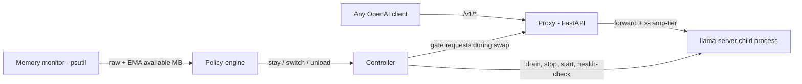

# RAMP — RAM-Aware Model Proxy

An **elastic local LLM daemon**. RAMP exposes one OpenAI-compatible endpoint,
continuously watches your machine's available memory, and transparently moves
the loaded model up and down a *quality ladder* (model size / quantization /
context length):

- You open Chrome with 40 tabs → RAMP swaps your 7B model for a 3B one.
- You close them → after a stable recovery window, the 7B comes back.
- Your assistant never dies with an OOM, and you never reconfigure anything.

Any client that speaks the OpenAI API — Open-LLM-VTuber, Khoj, SillyTavern,
LangChain, `curl` — just points its `base_url` at RAMP and works unchanged.

> **New here?** [docs/CONCEPTS.md](docs/CONCEPTS.md) explains what's actually
> going on: what consumes memory when an LLM runs, why VRAM pressure silently
> becomes RAM pressure, and the control-theory ideas (hysteresis, damping)
> behind the policy.

## Why this doesn't already exist

- **Ollama / LM Studio** pick a quantization *once*, at download/load time.
  Nothing adapts after that ([ollama#14674](https://github.com/ollama/ollama/issues/14674)).
- **[llama-swap](https://github.com/mostlygeek/llama-swap)** swaps models based
  on *which model the client requests* — the system's memory state is never
  consulted.
- **FlexQuant / LSAQ / Voltron / Any-Precision LLM** validated elastic
  execution academically; none ship as a usable daemon.

RAMP is the missing controller: policy-driven, hysteresis-damped, and
backend-agnostic.

## Architecture



| Module | Role |
|---|---|
| `monitor.py` | Samples available RAM, GPU/VRAM (NVIDIA, via `nvidia-smi`), and free disk — each with raw + smoothed readings. |
| `policy.py` | Pure state machine: fast downgrades under pressure, slow damped upgrades, critical-floor emergency handling. Fully unit-tested, no I/O. |
| `controller.py` | Executes decisions: drain in-flight requests → stop old backend → start new → reopen the gate. Restarts crashed backends. Records an event log. |
| `backend.py` | Child-process lifecycle for `llama-server` (real) or `ramp.mock_llm` (demo/tests). |
| `server.py` | OpenAI-compatible passthrough (incl. SSE streaming) + control API. |

### The decision policy

Every tier declares its footprint (`est_ram_mb`, and `est_vram_mb` when it
runs on the GPU), and the policy holds **RAM, VRAM, and disk** accountable:

- **Downgrade (fast):** free RAM below `safety_margin_mb` — or, for a
  GPU-resident tier, free VRAM below `vram_safety_margin_mb` — for
  `downgrade_after_samples` consecutive polls → switch to the largest smaller
  tier that fits *every* projected post-swap budget. A GPU-starved ladder can
  land on a CPU-only tier (`est_vram_mb: 0`).
- **Critical (instant):** free RAM below `critical_free_mb` → act immediately;
  if even the smallest tier can't fit, unload entirely (requests queue/503
  until memory returns).
- **Upgrade (slow):** a bigger tier must fit both RAM and VRAM budgets with
  *extra* headroom (`upgrade_extra_mb` / `vram_upgrade_extra_mb`), sustained
  for `upgrade_after_s` seconds, before it's loaded — so RAMP never thrashes
  when you alt-tab.
- **Disk (gate):** free disk below `disk_min_free_mb` blocks upgrades — a
  bigger model can't free disk, so it gates rather than downgrades — and is
  flagged in `/ramp/status` (`disk.low: true`).
- No NVIDIA GPU (or no `nvidia-smi`)? VRAM constraints are simply not
  enforced; everything else works unchanged.
- Swaps happen **between** requests: in-flight generations are drained first
  (up to `drain_timeout_s`), and incoming requests wait on the swap gate
  instead of failing.

## Quick start (no models needed)

```bash
pip install -e .[dev]
ramp -c examples/ramp.mock.yaml
```

Then, in another terminal:

```bash
curl http://127.0.0.1:8090/ramp/status
curl http://127.0.0.1:8090/v1/chat/completions -H "Content-Type: application/json" -d "{\"model\":\"auto\",\"messages\":[{\"role\":\"user\",\"content\":\"hi\"}]}"
python scripts/stress_ram.py --mb 6000 --hold-s 60
```

Watch the reply tag flip from `[large-mock]` to a smaller tier while the
stress script runs, and back ~20s after it releases. Every response carries
an `x-ramp-tier` header naming the tier that produced it.

## Real models (Ollama backend)

If you already run [Ollama](https://ollama.com) (or your OS blocks unsigned
binaries — e.g. Windows Smart App Control), use `backend: ollama`
(see [examples/ramp.ollama.yaml](examples/ramp.ollama.yaml)). Tiers reference
Ollama model tags; RAMP loads/unloads them via `keep_alive`, rewrites each
request's `model` field to the active tier, and proxies to Ollama's OpenAI
API. Import your own GGUFs with `ollama create <tag> -f Modelfile`
(`FROM ./model.gguf`). If no Ollama server is running, RAMP spawns one.

## Real models (llama.cpp)

1. Install [llama.cpp](https://github.com/ggml-org/llama.cpp) so `llama-server`
   is on your PATH (or set `llama_server_bin` to its full path).
2. Download 2–3 GGUF models of different sizes (e.g. Qwen2.5 7B/3B/0.5B
   instruct, Q4_K_M).
3. Edit `examples/ramp.yaml` — paths, `ctx`, and `est_ram_mb` per tier.
   To calibrate `est_ram_mb`: pin the tier, look at the llama-server process
   in Task Manager, round up.
4. `ramp -c examples/ramp.yaml`, then point any OpenAI client at
   `http://127.0.0.1:8090/v1`.

## Control API

| Endpoint | Purpose |
|---|---|
| `GET /ramp/status` | Current tier, RAM/GPU/disk readings, `last_decision` (why RAMP is holding — e.g. `disk-low`, `upgrade-pending`), tier ladder, and event log. |
| `POST /ramp/pin/{name}` | Force a tier; disables auto-calibration. |
| `DELETE /ramp/pin` | Resume auto-calibration. |

## Tests

```bash
pytest
```

Unit tests cover the policy state machine exhaustively (RAM pressure, VRAM
pressure, the disk gate, hysteresis in both directions); integration tests
run the full daemon against real child processes with scripted resource
readings, driving the ladder down, up, through critical unload, streaming,
manual pinning, and a swap/poll race regression.

To reproduce the resource behaviours against real models, see
[examples/ramp.ollama.yaml](examples/ramp.ollama.yaml) (normal ladder) and
[examples/ramp.vram-test.yaml](examples/ramp.vram-test.yaml) (isolates VRAM
pressure: occupy the GPU with another model and watch RAMP fall back to a
CPU-only tier while system RAM stays healthy).

## Roadmap

- **Context-length scaling** — shrink the KV cache before swapping models
  (cheaper first response to pressure).
- **Any-Precision backend** — one weight file servable at 3/4/8-bit
  ([paper](https://arxiv.org/abs/2402.10517)) makes downgrades near-free.
- **OS pressure signals** — Windows memory notifications / Linux PSI instead
  of pure polling.
- **Multi-GPU and non-NVIDIA GPUs** — the monitor currently reads the first
  NVIDIA GPU via `nvidia-smi`.

## Research & prior art

RAMP is the productization of an idea validated across several research
papers, none of which shipped as a usable daemon:

- **[FlexQuant](https://arxiv.org/abs/2501.07139)** (Chai et al., 2025) —
  elastic quantization ensembles for edge devices with fluctuating unified
  memory; the closest academic statement of RAMP's problem.
- **[Any-Precision LLM](https://arxiv.org/abs/2402.10517)** (Park et al.,
  2024) — one overlaid weight file servable at 3/4/…/n bits; the enabling
  engine for making RAMP's downgrades near-free (roadmap).
- **[LSAQ](https://arxiv.org/abs/2412.18135)** (2024) — layer-specific
  adaptive quantization chosen per memory budget on edge devices.
- **[Voltron](https://arxiv.org/abs/2607.07046)** (2026) — monitors KV-cache
  size and free memory *during* generation and scales precision mid-stream.
- **[MoBiQuant](https://arxiv.org/abs/2602.20191)** (2026) — token-adaptive
  any-precision inference with efficient runtime bit-width switching.
- **[PowerInfer](https://arxiv.org/abs/2312.12456)** / **[AirLLM](https://github.com/lyogavin/airllm)** —
  static strategies for *fitting* oversized models (hot/cold neuron
  offloading; layer streaming), complementary to RAMP's elasticity.

Prior tools that solve adjacent problems: [llama-swap](https://github.com/mostlygeek/llama-swap)
(swaps models on client request, not system state), Ollama/LM Studio
(one-time hardware detection at load; see [ollama#14674](https://github.com/ollama/ollama/issues/14674)).

## License

MIT
